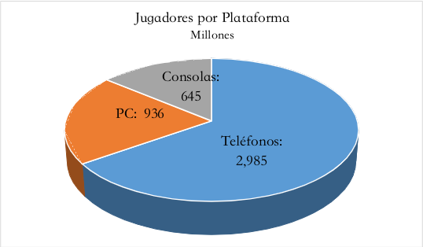
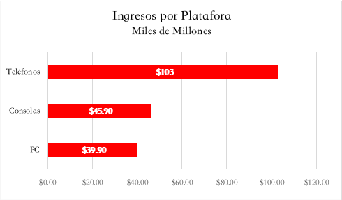
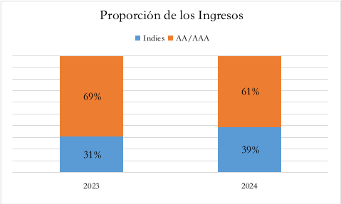
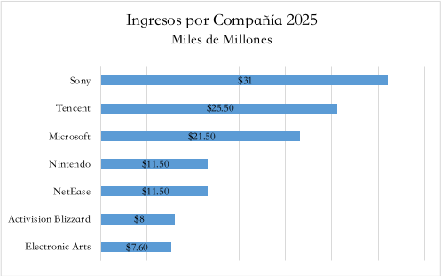

2025 ha sido un gran año para las empresas dentro de la industria de los videojuegos, superando en algunos rubros las expectativas de crecimiento. En un ambiente de festividad, algunos analistas ya han mirado a través de su bola de cristal para los mercados en 2026, sin embargo, y sin ningún lugar a dudas, las visiones que han tenido no han contemplado el estado actual, y futuro a corto y mediano plazo, de la industria del hardware para las consolas. Sí, me refiero a la situación del vertiginoso incremento de la demanda de memorias y chips por parte de las compañías que ofrecen servicios de Inteligencia Artificial.

En fin, eso es tema para el futuro. Por lo mientras, en adelante te ofrezco algunos datos generales recopilados de algunos informes sobre el estado de la industria. Por ahora, abramos los portones del Observatorio y revisemos algunas cifras generales reunidas a partir de distintos reportes del sector. Como suele ocurrir, los números varían ligeramente entre fuentes; sin embargo, las tendencias son claras… y bastante reveladoras.

## Gamers y sus plataformas: El reino del celular

Para sorpresa de nadie, el trono del ecosistema gamer sigue en manos de los dispositivos móviles. Después vienen los jugadores de PC y, en último lugar, los de consola. A la par de este crecimiento, los usuarios dedican, en promedio, cerca de una cuarta parte de su tiempo en línea a jugar (Bain & Company). Nada extraño si consideramos que la mayoría de ellos vive en el ecosistema del smartphone.

Algunos apuntes del año:

- El crecimiento de los jugadores en móviles se desarrolló según lo esperado. Lo más relevante fue la adaptación de juegos a sistemas operativos utilizados en teléfonos fabricados en China, tras la salida de los servicios de Google. Una vez resuelto el obstáculo, se espera una aceleración del mercado móvil en teléfonos chinos.
- En PC, los usuarios de Steam aumentaron respecto al año anterior, impulsados sobre todo por Japón y China. En contraste, la base de jugadores de Epic se redujo.

## Farmeando oros: ¿de dónde viene el botín?

Según las estimaciones de los brujos especialistas, los ingresos totales de la industria ascendieron a $188.8 miles de millones de dólares en 2025 (en adelante, miles de millones de dólares = MMD), donde, una vez más, los jueguitos de teléfonos son los que más han saqueado los oros de los gamers (Investgame). Los brujos financieros del sector estiman que los ingresos totales de la industria alcanzaron los **$188.8 MMD** en 2025 (Investgame). Y, una vez más, el botín mayor provino del reino móvil.

Un punto interesante:

- El crecimiento de ingresos en consolas está fuertemente relacionado con el precio actual de los videojuegos. Nintendo, con el lanzamiento de Switch 2, funge como punta de lanza. Así, aun con menos jugadores que PC, las consolas logran mayores ingresos por unidad vendida.
- Llama la atención que el crecimiento en los ingresos de las consolas se deban los precios actuales de los videojuegos, donde Nintendo con su Switch 2 es la punta de lanza. Esto explica cómo, con menos jugadores, las consolas tienen más ingresos que los de PC.

En cuanto a la distribución geográfica del loot, la mayor parte se generó en la región de Asia-Pacífico, con China como jugador clave del tablero.

| Región | Ingresos (MDD) |
|:--------:|:--------:|
| Asia y Pacífico | $87.60 |
| Norte América | $52.70 |
| Europa	| $33.10 |
| América Latina | $8.30 |
| África | $7.10|

## Los Looters: indies vs AA, AAA

Si algo dejaron ver las nominaciones al Juego del Año en los últimos Game Awards fue la presencia sólida de los llamados “indies” —cualquiera que sea la definición que utilicemos para el término. Y no solo brillaron en prestigio. Aunque aún no se publican cifras definitivas para 2025, los ingresos de estudios independientes en Steam mostraron un crecimiento significativo hasta 2024 (Bain & Company).

Si asumimos una tendencia similar para 2025:

- Está claro que los estudios indies atraviesan un momento especialmente favorable.
- Según Bain & Company, las grandes desarrolladoras enfrentan dificultades para rentabilizar sus proyectos, en buena medida por el incremento de los costos de producción.
- Del lado de la demanda, los jugadores concentran su atención en experiencias independientes y en plataformas-juego (Roblox y/o Fortnite), desplazando parcialmente a títulos AA y AAA.

Aun así, 2025 tuvo un claro ganador en términos de ingresos (Udonis):

- Sony Interactive Entertainment incluye ventas de consolas.
- Microsoft aparece sin considerar ciertas filiales.

El panorama no deja de ser interesante: grandes producciones con márgenes presionados, mientras estudios más pequeños encuentran espacio para crecer… a menor costo y con audiencias fieles.

## **Epílogo: un buen año… con nubarrones en el horizonte**

2025 fue un gran año para los jugadores: lanzamientos diversos, buenos catálogos y más opciones para todo tipo de bolsillos. El auge de los indies y de juegos AA tiene una ventaja clara:

- permite que más personas puedan jugar sin necesidad de un hardware de alta gama,
- con una PC media es posible acceder a experiencias de calidad más que digna.

Pero el 2026 trae una incógnita mayor:

- el impacto del encarecimiento del hardware,
- la competencia por memoria y chips,
- la presión tecnológica derivada de la IA.

Si el costo de los equipos aumenta, el equilibrio entre acceso, precio y experiencia volverá a ponerse en el centro del debate. Y aquí, desde el Atrio del Videojuego, estaremos atentos para observarlo.

---

## Referencias

**Bain & Company:** https://www.bain.com/insights/squeezed-in-the-middle-aaa-gaming-studios-must-adapt-gaming-report-2025/

**Investgame:** https://investgame.net/wp-content/uploads/2025/09/2025_Newzoo_Free_Global_Games_Market_Report.pdf

**Udonis:** https://www.blog.udonis.co/mobile-marketing/mobile-games/gaming-industry

**Game World Observer:** https://gameworldobserver.com/2025/12/23/the-gaming-industry-in-2025-by-the-numbers-an-overview-from-gamesindustry

